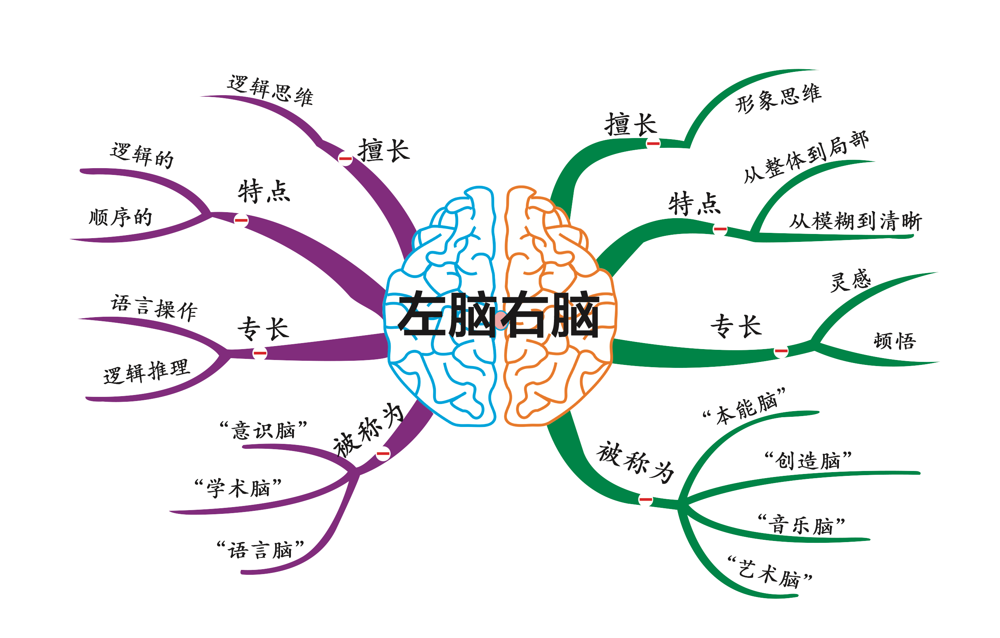
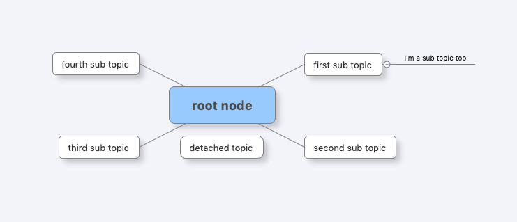
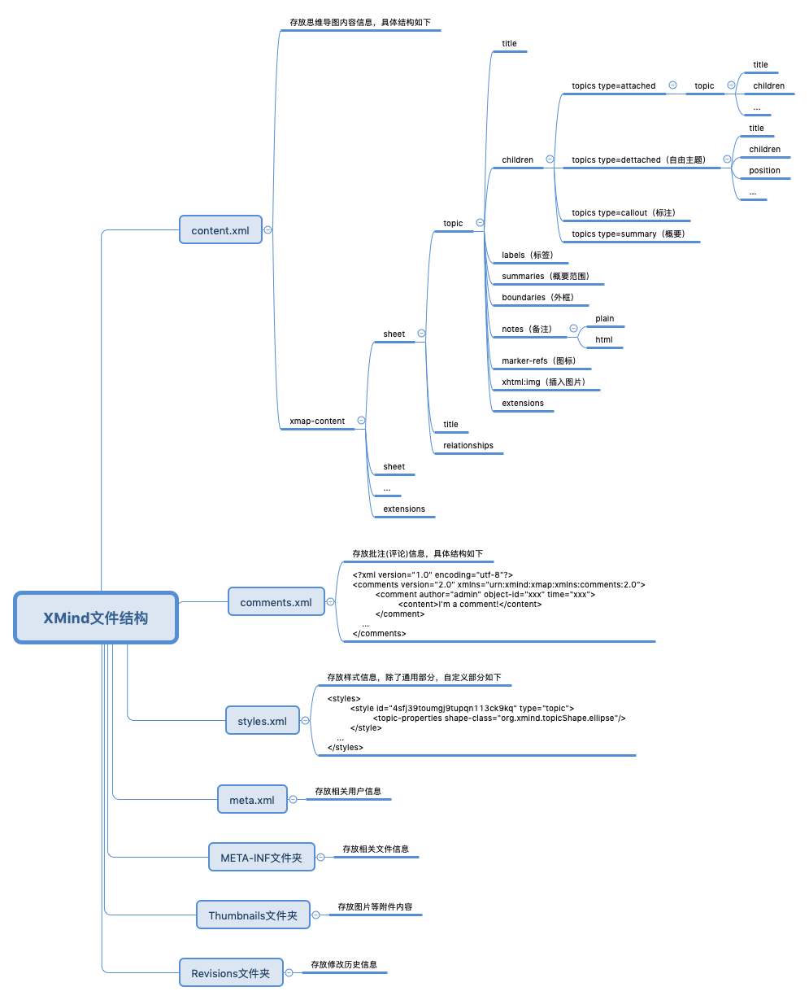
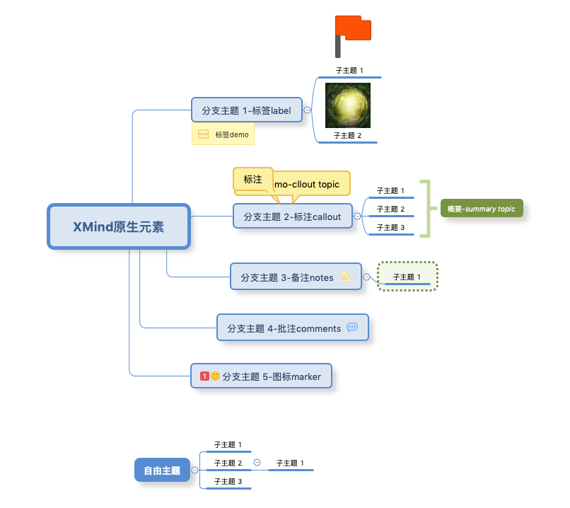
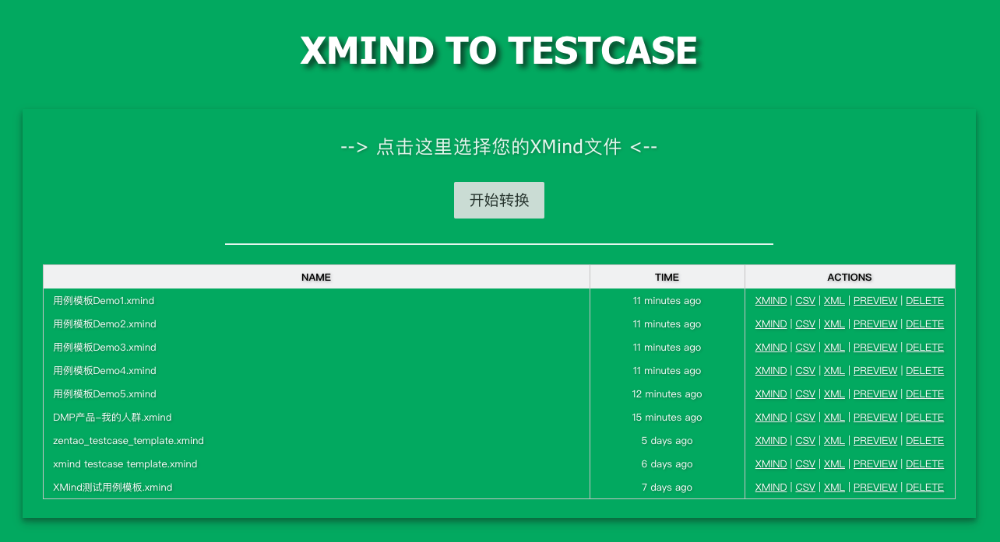
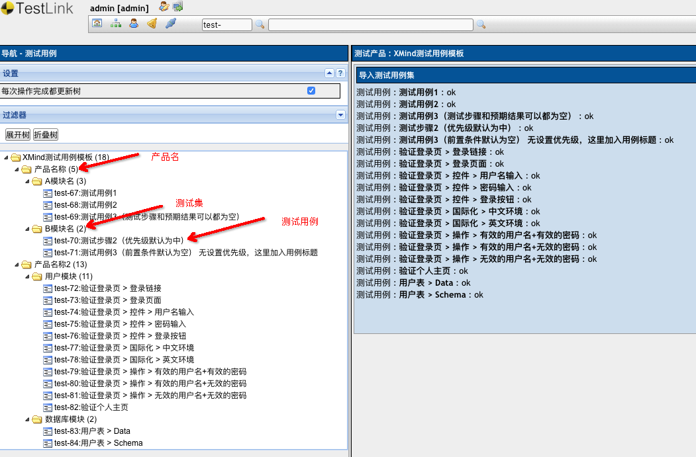
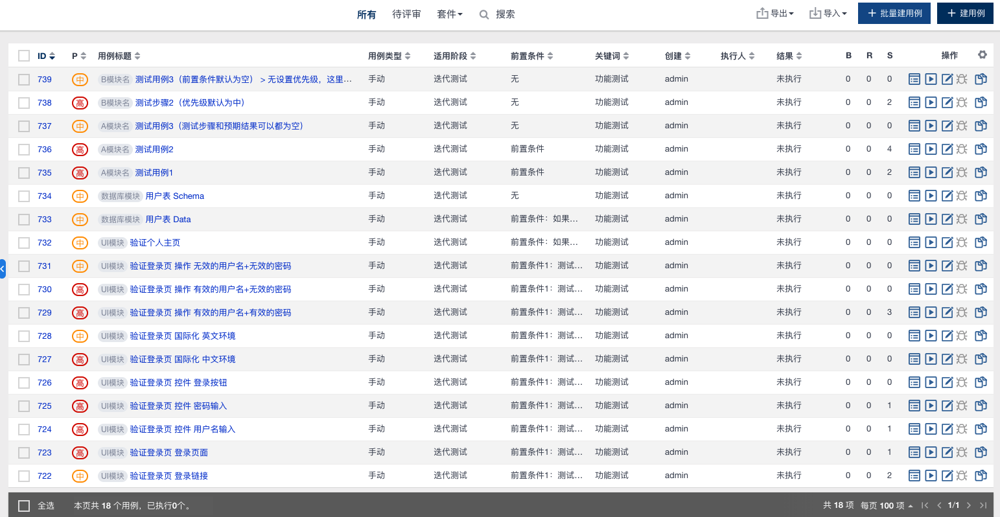

# XMind

**XMind** 是基于 Python 实现，提供了对 [XMind思维导图](https://www.xmind.cn/)进行创建、解析、更新的一站式解决方案！



### 一、安装方式
```
pip3 install XMind  

or

pip3 install xmind
```


### 二、版本升级
```
pip3 install -U XMind
```


### 三、使用方式

#### 1、创建XMind文件
```
def gen_my_xmind_file():  
    # 1、如果指定的XMind文件存在，则加载，否则创建一个新的
    workbook = xmind.load("my.xmind")
    
    # 2、获取第一个画布（Sheet），默认新建一个XMind文件时，自动创建一个空白的画布
    sheet1 = workbook.getPrimarySheet()
    # 对第一个画布进行设计完善，具体参照下一个函数
    design_sheet1(sheet1)
    
    # 3、创建第二个画布
    gen_sheet2(workbook, sheet1)
    
    # 4、保存（如果指定path参数，另存为该文件名）
    xmind.save(workbook, path='test.xmind')
```



```
def design_sheet1(sheet1):
    # ***** 第一个画布 *****
    sheet1.setTitle("first sheet")  # 设置画布名称

    # 获取画布的中心主题，默认创建画布时会新建一个空白中心主题
    root_topic1 = sheet1.getRootTopic()
    root_topic1.setTitle("root node")  # 设置主题名称

    # 创建一个子主题，并设置其名称
    sub_topic1 = root_topic1.addSubTopic()
    sub_topic1.setTitle("first sub topic")

    sub_topic2 = root_topic1.addSubTopic()
    sub_topic2.setTitle("second sub topic")

    sub_topic3 = root_topic1.addSubTopic()
    sub_topic3.setTitle("third sub topic")

    sub_topic4 = root_topic1.addSubTopic()
    sub_topic4.setTitle("fourth sub topic")

    # 除了新建子主题，还可以创建自由主题(注意:只有中心主题支持创建自由主题)
    detached_topic1 = root_topic1.addSubTopic(topics_type=TOPIC_DETACHED)
    detached_topic1.setTitle("detached topic")
    detached_topic1.setPosition(0, 30)

    # 创建一个子主题的子主题
    sub_topic1_1 = sub_topic1.addSubTopic()
    sub_topic1_1.setTitle("I'm a sub topic too")
```


```
def gen_sheet2(workbook, sheet1):
    # ***** 设计第二个画布 *****
    sheet2 = workbook.createSheet()
    sheet2.setTitle("second sheet")

    # 获取画布的中心主题
    root_topic2 = sheet2.getRootTopic()
    root_topic2.setTitle("root node")

    # 使用另外一种方法创建子主题
    topic1 = TopicElement(ownerWorkbook=workbook)
    # 给子主题添加一个主题间超链接，通过指定目标主题ID即可，这里链接到第一个画布
    topic1.setTopicHyperlink(sheet1.getID())
    topic1.setTitle("redirection to the first sheet")

    topic2 = TopicElement(ownerWorkbook=workbook)
    topic2.setTitle("topic with an url hyperlink")
    # 给子主题添加一个URL超链接
    topic2.setURLHyperlink("https://github.com/zhuifengshen/xmind")

    topic3 = TopicElement(ownerWorkbook=workbook)
    topic3.setTitle("third node")
    # 给子主题添加一个备注（快捷键F4)
    topic3.setPlainNotes("notes for this topic")
    topic3.setTitle("topic with \n notes")

    topic4 = TopicElement(ownerWorkbook=workbook)
    # 给子主题添加一个文件超链接
    topic4.setFileHyperlink("logo.png")
    topic4.setTitle("topic with a file")

    topic1_1 = TopicElement(ownerWorkbook=workbook)
    topic1_1.setTitle("sub topic")
    # 给子主题添加一个标签（目前XMind软件仅支持添加一个，快捷键）
    topic1_1.addLabel("a label")

    topic1_1_1 = TopicElement(ownerWorkbook=workbook)
    topic1_1_1.setTitle("topic can add multiple markers")
    # 给子主题添加两个图标
    topic1_1_1.addMarker(MarkerId.starBlue)
    topic1_1_1.addMarker(MarkerId.flagGreen)

    topic2_1 = TopicElement(ownerWorkbook=workbook)
    topic2_1.setTitle("topic can add multiple comments")
    # 给子主题添加一个批注（评论）
    topic2_1.addComment("I'm a comment!")
    topic2_1.addComment(content="Hello comment!", author='devin')

    # 将创建好的子主题添加到其父主题下
    root_topic2.addSubTopic(topic1)
    root_topic2.addSubTopic(topic2)
    root_topic2.addSubTopic(topic3)
    root_topic2.addSubTopic(topic4)
    topic1.addSubTopic(topic1_1)
    topic2.addSubTopic(topic2_1)
    topic1_1.addSubTopic(topic1_1_1)

    # 给中心主题下的每个子主题添加一个优先级图标
    topics = root_topic2.getSubTopics()
    for index, topic in enumerate(topics):
        topic.addMarker("priority-" + str(index + 1))

    # 添加一个主题与主题之间的联系
    sheet2.createRelationship(topic1.getID(), topic2.getID(), "relationship test") 
```
具体代码参考：[create_xmind.py](example/create_xmind.py)


#### 2、解析XMind文件

##### (1) 将XMind文件转换为Dict数据 / JSON数据
```
import xmind
workbook = xmind.load('demo.xmind')
print(workbook.getData())
print(workbook.to_prettify_json())


Output:

[                                                                # 画布列表
    {                                                            # 第1个画布数据
        "id": "2cc3b068922063a81a20029655",                      # 画布ID
        "title": "first sheet",                                  # 画布名称
        "topic": {                                               # 中心主题
            "id": "2cc3b06892206f95288e487b6c",                  # 主题ID
            "link": null,                                        # 超链接信息
            "title": "root node",                                # 主题名称
            "note": null,                                        # 备注信息
            "label": null,                                       # 便签信息
            "comment": null,                                     # 批注(评论)信息
            "markers": [],                                       # 图标列表
            "topics": [                                          # 子主题列表
                {
                    "id": "2cc3b06892206c816e1cb55ddc",          # 子主题ID
                    "link": null,
                    "title": "first sub topic",
                    "note": null,
                    "label": null,
                    "comment": null,
                    "markers": [],
                    "topics": [                                  # 子主题下的子主题列表
                        {
                            "id": "b0ed74214dbca939935b981906",
                            "link": null,
                            "title": "I'm a sub topic too",
                            "note": null,
                            "label": null,
                            "comment": null,
                            "markers": []
                        }
                    ]
                },
                {
                    "id": "b0ed74214dbca693b947ef03fa",
                    "link": null,
                    "title": "second sub topic",
                    "note": null,
                    "label": null,
                    "comment": null,
                    "markers": []
                },
                {
                    "id": "b0ed74214dbca1fe9ade911b94",
                    "link": null,
                    "title": "third sub topic",
                    "note": null,
                    "label": null,
                    "comment": null,
                    "markers": []
                },
                {
                    "id": "b0ed74214dbcac00c0eb368b53",
                    "link": null,
                    "title": "fourth sub topic",
                    "note": null,
                    "label": null,
                    "comment": null,
                    "markers": []
                }
            ]
        }
    },
    {
        "id": "b0ed74214dbcafdd0799f81ebf",
        "title": "second sheet",                                         # 第2个画布数据
        "topic": {
            "id": "b0ed74214dbcac7567f88365c2",
            "link": null,
            "title": "root node",
            "note": null,
            "label": null,
            "comment": null,
            "markers": [],
            "topics": [
                {
                    "id": "b0ed74214dbca8bfdc2b60df47",
                    "link": "xmind:#2cc3b068922063a81a20029655",
                    "title": "redirection to the first sheet",
                    "note": null,
                    "label": null,
                    "comment": null,
                    "markers": [
                        "priority-1"
                    ],
                    "topics": [
                        {
                            "id": "e613d79938591579e707a7a161",
                            "link": null,
                            "title": "sub topic",
                            "note": null,
                            "label": "a label",
                            "comment": null,
                            "markers": [],
                            "topics": [
                                {
                                    "id": "e613d799385912cca5eb579fb3",
                                    "link": null,
                                    "title": "topic can add multiple markers",
                                    "note": null,
                                    "label": null,
                                    "comment": null,
                                    "markers": [
                                        "star-blue",
                                        "flag-green"
                                    ]
                                }
                            ]
                        }
                    ]
                },
                {
                    "id": "e613d79938591ef98b64a768db",
                    "link": "https://xmind.net",
                    "title": "topic with an url hyperlink",
                    "note": null,
                    "label": null,
                    "comment": null,
                    "markers": [
                        "priority-2"
                    ],
                    "topics": [
                        {
                            "id": "e613d799385916ed8f3ea382ca",
                            "link": null,
                            "title": "topic can add multiple comments",
                            "note": null,
                            "label": null,
                            "comment": "I'm a comment!\nHello comment!",
                            "markers": []
                        }
                    ]
                },
                {
                    "id": "e613d799385919451116404d66",
                    "link": null,
                    "title": "topic with \n notes",
                    "note": "notes for this topic",
                    "label": null,
                    "comment": null,
                    "markers": [
                        "priority-3"
                    ]
                },
                {
                    "id": "e613d7993859156671fa2c12a5",
                    "link": "file:///Users/zhangchuzhao/Project/python/tmp/xmind/example/xminddemo/logo.png",
                    "title": "topic with a file",
                    "note": null,
                    "label": null,
                    "comment": null,
                    "markers": [
                        "priority-4"
                    ]
                }
            ]
        }
    }
]
```

##### （2）将画布转换为Dict数据
```
import xmind
workbook = xmind.load('demo.xmind')
sheet = workbook.getPrimarySheet()
print(sheet.getData())


Output:

{
    "id": "2cc3b068922063a81a20029655",
    "title": "first sheet",
    "topic": {
        "id": "2cc3b06892206f95288e487b6c",
        "link": null,
        "title": "root node",
        "note": null,
        "label": null,
        "comment": null,
        "markers": [],
        "topics": [
            {
                "id": "2cc3b06892206c816e1cb55ddc",
                "link": null,
                "title": "first sub topic",
                "note": null,
                "label": null,
                "comment": null,
                "markers": [],
                "topics": [
                    {
                        "id": "b0ed74214dbca939935b981906",
                        "link": null,
                        "title": "I'm a sub topic too",
                        "note": null,
                        "label": null,
                        "comment": null,
                        "markers": []
                    }
                ]
            },
            {
                "id": "b0ed74214dbca693b947ef03fa",
                "link": null,
                "title": "second sub topic",
                "note": null,
                "label": null,
                "comment": null,
                "markers": []
            },
            {
                "id": "b0ed74214dbca1fe9ade911b94",
                "link": null,
                "title": "third sub topic",
                "note": null,
                "label": null,
                "comment": null,
                "markers": []
            },
            {
                "id": "b0ed74214dbcac00c0eb368b53",
                "link": null,
                "title": "fourth sub topic",
                "note": null,
                "label": null,
                "comment": null,
                "markers": []
            }
        ]
    }
}
```

##### (3) 将主题转换为Dict数据
```
import xmind
workbook = xmind.load('demo.xmind')
sheet = workbook.getPrimarySheet()
root_topic = sheet.getRootTopic()
print(root_topic.getData())


Output:

{
    "id": "2cc3b06892206f95288e487b6c",
    "link": null,
    "title": "root node",
    "note": null,
    "label": null,
    "comment": null,
    "markers": [],
    "topics": [
        {
            "id": "2cc3b06892206c816e1cb55ddc",
            "link": null,
            "title": "first sub topic",
            "note": null,
            "label": null,
            "comment": null,
            "markers": [],
            "topics": [
                {
                    "id": "b0ed74214dbca939935b981906",
                    "link": null,
                    "title": "I'm a sub topic too",
                    "note": null,
                    "label": null,
                    "comment": null,
                    "markers": []
                }
            ]
        },
        {
            "id": "b0ed74214dbca693b947ef03fa",
            "link": null,
            "title": "second sub topic",
            "note": null,
            "label": null,
            "comment": null,
            "markers": []
        },
        {
            "id": "b0ed74214dbca1fe9ade911b94",
            "link": null,
            "title": "third sub topic",
            "note": null,
            "label": null,
            "comment": null,
            "markers": []
        },
        {
            "id": "b0ed74214dbcac00c0eb368b53",
            "link": null,
            "title": "fourth sub topic",
            "note": null,
            "label": null,
            "comment": null,
            "markers": []
        }
    ]
}
```

##### (4) 自定义解析
```
import xmind
workbook = xmind.load('demo.xmind')
custom_parse_xmind(workbook)


def custom_parse_xmind(workbook):
    elements = {}

    def _echo(tag, element, indent=0):
        title = element.getTitle()
        elements[element.getID()] = title
        print('\t' * indent, tag, ':', pipes.quote(title))

    def dump_sheet(sheet):
        root_topic = sheet.getRootTopic()
        _echo('RootTopic', root_topic, 1)

        for topic in root_topic.getSubTopics() or []:
            _echo('AttachedSubTopic', topic, 2)

        for topic in root_topic.getSubTopics(xmind.core.const.TOPIC_DETACHED) or []:
            _echo('DetachedSubtopic', topic, 2)

        for rel in sheet.getRelationships():
            id1, id2 = rel.getEnd1ID(), rel.getEnd2ID()
            print('Relationship: [%s] --> [%s]' % (elements.get(id1), elements.get(id2)))

    for sheet in workbook.getSheets():
        _echo('Sheet', sheet)
        dump_sheet(sheet)


Output:

 Sheet : 'first sheet'
	 RootTopic : 'root node'
		 AttachedSubTopic : 'first sub topic'
		 AttachedSubTopic : 'second sub topic'
		 AttachedSubTopic : 'third sub topic'
		 AttachedSubTopic : 'fourth sub topic'
		 DetachedSubtopic : 'detached topic'
 Sheet : 'second sheet'
	 RootTopic : 'root node'
		 AttachedSubTopic : 'redirection to the first sheet'
		 AttachedSubTopic : 'topic with an url hyperlink'
		 AttachedSubTopic : 'topic with 
 notes'
		 AttachedSubTopic : 'topic with a file'
Relationship: [redirection to the first sheet] --> [topic with an url hyperlink]
```
具体代码参考：[parse_xmind.py](example/parse_xmind.py)


#### 3、更新保存XMind文件

##### （1）五种保存方法
```
import xmind
# 加载XMind文件demo.xmind
workbook = xmind.load('demo.xmind')  
primary_sheet = workbook.getPrimarySheet()
root_topic = primary_sheet.getRootTopic()
# 给中心主题添加一个星星图标
root_topic.addMarker(MarkerId.starRed)

# 第1种：默认保存所有的内容，这里保存时另存为xmind_update_demo.xmind（推荐）
xmind.save(workbook=workbook, path='xmind_update_demo.xmind')

# 第2种：只保存思维导图内容content.xml核心文件，适用于没有添加评论、自定义样式和附件的情况
xmind.save(workbook=workbook, path='xmind_update_demo1.xmind', only_content=True)

# 第3种：只保存content.xml、comments.xml、styles.xml三个核心文件，适用于没有附件的情况
xmind.save(workbook=workbook, path='xmind_update_demo2.xmind', except_attachments=True)

# 4、除了修改记录，其他内容都保存，因为XMind文件的修改记录文件夹比较大，以便节约内存（推荐）
xmind.save(workbook=workbook, path='xmind_update_demo3.xmind', except_revisions=True)

# 5、不指定保存路径，直接更新原文件
xmind.save(workbook)
```
具体代码参考：[update_xmind.py](example/update_xmind.py)


##### （2）XMind文件结构




### 四、工具支持功能

#### 1、支持XMind以下原生元素的创建、解析和更新
- 画布(Sheet)
- 主题(Topic：固定主题、自由主题)
- 图标(Marker：[图标名称](xmind/core/markerref.py))
- 备注(Note)
- 标签(Label)
- 批注(Comment)
- 联系(Relationship)
- 样式(Styles)

#### 2、XMind原生元素



其中，暂不支持的元素（日常也比较少用到）
- 标注（cllout topic)
- 概要（summary topic)
- 外框（outline border)
- 附件


### 五、应用场景

[XMind2TestCase](https://github.com/zhuifengshen/xmind2testcase)：一个高效测试用例设计的解决方案！

该方案通过制定测试用例通用模板， 然后使用 XMind 这款广为流传且开源的思维导图工具进行用例设计。

然后基于通用的测试用例模板，在 XMind 文件上解析并提取出测试用例所需的基本信息， 合成常见测试用例管理系统所需的用例导入文件。

实现将 XMind 设计测试用例的便利与常见测试用例系统的高效管理完美结合起来了，提升日常测试工作的效率！

使用流程如下：

#### 1、使用Web工具进行XMind用例文件解析



#### 2、转换后的用例预览


#### 3、用例导入TestLink系统



#### 4、用例导入Zentao（禅道）系统




### 六、自动化测试与发布

#### 1、自动化单元测试(TODO: 待上传)
```
python3 -m unittest discover
```

#### 2、一键打 Tag 并上传至 PYPI 

每次在 __ about __.py 更新版本号后，运行以下命令，实现自动化更新打包上传至 [PYPI](https://pypi.org/) ，同时根据其版本号自动打 Tag 并推送到仓库：
```
python3 setup.py pypi
```


### 七、致谢
在此，衷心感谢 **XMind 思维导图**官方创造了这么一款激发灵感、创意，提升工作、生活效率的高价值生产力产品，
同时还开源 [xmind-sdk-python](https://github.com/xmindltd/xmind-sdk-python) 工具帮助开发者构建自己的 XMind 文件 ，本项目正是基于此工具进行扩展和升级，受益匪浅，感恩！

得益于开源，也将坚持开源，并为开源贡献自己的点滴之力。后续，将继续根据实际项目需要，定期进行维护更新和完善，欢迎大伙的使用和[意见反馈](https://github.com/zhuifengshen/xmind/issues/new)，谢谢！

（如果本项目对你有帮助的话，也欢迎 _**star**_ ）


### LICENSE
```
The MIT License (MIT)

Copyright (c) 2019 Devin https://zhangchuzhao.site
Copyright (c) 2013 XMind, Ltd

Permission is hereby granted, free of charge, to any person obtaining a copy of
this software and associated documentation files (the "Software"), to deal in
the Software without restriction, including without limitation the rights to
use, copy, modify, merge, publish, distribute, sublicense, and/or sell copies of
the Software, and to permit persons to whom the Software is furnished to do so,
subject to the following conditions:

The above copyright notice and this permission notice shall be included in all
copies or substantial portions of the Software.

THE SOFTWARE IS PROVIDED "AS IS", WITHOUT WARRANTY OF ANY KIND, EXPRESS OR
IMPLIED, INCLUDING BUT NOT LIMITED TO THE WARRANTIES OF MERCHANTABILITY, FITNESS
FOR A PARTICULAR PURPOSE AND NONINFRINGEMENT. IN NO EVENT SHALL THE AUTHORS OR
COPYRIGHT HOLDERS BE LIABLE FOR ANY CLAIM, DAMAGES OR OTHER LIABILITY, WHETHER
IN AN ACTION OF CONTRACT, TORT OR OTHERWISE, ARISING FROM, OUT OF OR IN
CONNECTION WITH THE SOFTWARE OR THE USE OR OTHER DEALINGS IN THE SOFTWARE.
```
